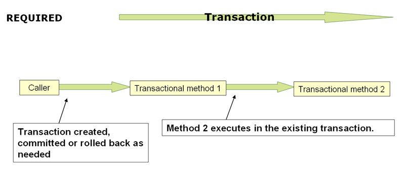

# Transaction management

With spring

---

## Transaction

|>


Note:
No transaction, so your money will be deducted

|>


Note: Transaction, so nothing happens with your money

---

## Local vs Global Transactions

Note:
Local transactions is a resource specific transaction only connected to a single resource</br>
Global transaction is a transaction managed by a separate dedicated transaction manager.
Used for multiple transactions 

---

## Why Spring Transaction management?

Note:
Seperation of the demarcation and implementation
Abstraction of the implementation details
Global and local transaction have the same interface

---

## How does it work?

Note:
`` @Transactional `` </br>
`` @EnableTransactionManagement ``
TransactionManager defined

|>

```java
public interface PlatformTransactionManager {

    TransactionStatus getTransaction(
            TransactionDefinition definition) 
                throws TransactionException;

    void commit(TransactionStatus status) 
                throws TransactionException;

    void rollback(TransactionStatus status) 
                throws TransactionException;
}
```

|>

```java
public interface TransactionStatus extends SavepointManager{
    boolean isNewTransaction();
    boolean hasSavepoint();
    void setRollbackOnly();
    boolean isRollbackOnly();
    void flush();
    boolean isCompleted();
}
```

|>


|>

```java
public @interface Transactional {
	@AliasFor("transactionManager")
	String value() default "";
	@AliasFor("value")
	String transactionManager() default "";
	Propagation propagation() default Propagation.REQUIRED;
	Isolation isolation() default Isolation.DEFAULT;
	int timeout() default TransactionDefinition.TIMEOUT_DEFAULT;
	boolean readOnly() default false;
	Class<? extends Throwable>[] rollbackFor() default {};
	String[] rollbackForClassName() default {};
	Class<? extends Throwable>[] noRollbackFor() default {};
	String[] noRollbackForClassName() default {};
}
```

---

## Propagation

Note:
How transaction are related to eachother 

|>

### Difference between physical and logical transactions

Note:
Physical transaction is the actual transaction that will be handled over the complete system.
Logical transaction can determine the status of a physical transaction but doesn't commit or rolleback itself

|>



|>


|>

```java
MANDATORY
NESTED
NEVER
NOT_SUPPORTED
SUPPORTS
```

Note:
Mandatory: Needs one crashes when none exists</br>
Nested: One physical but has save points</br>
Never: throws an exception if a transaction exists</br>
Not supported: Will suspend the transaction</br>
Supports: Will work with or without transaction</br>

---

## Isolation

Note:
Isolation is about how isolated is a transaction

|>

```java
DEFAULT
READ_COMMITTED
READ_UNCOMMITTED
REPEATABLE_READ
SERIALIZABLE
```

Note:
DEFAULT: use the isolation level of your data reader
READ_COMMITTED: Read the current known data but don't block updates
REPEATABLE_READ: Read the current known data and block updates of selected rows
SERIALIZABLE: Read the current known data and block updates and inserts of all rows